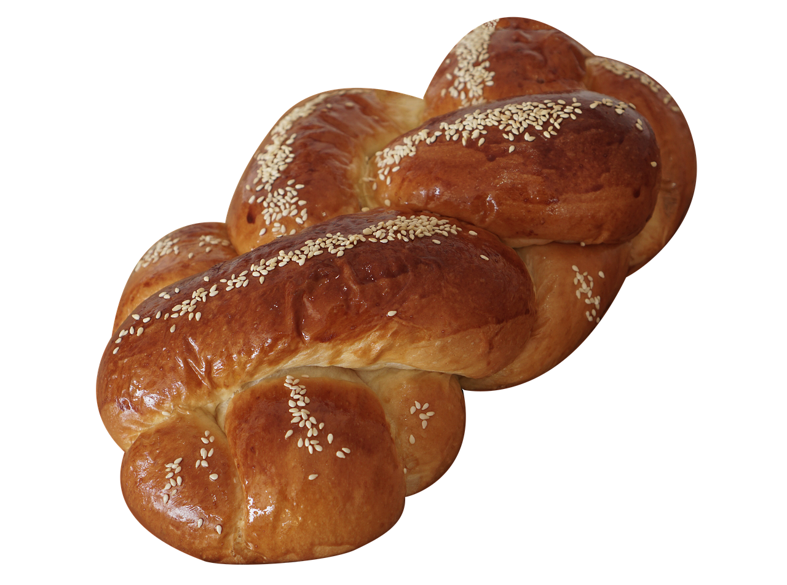
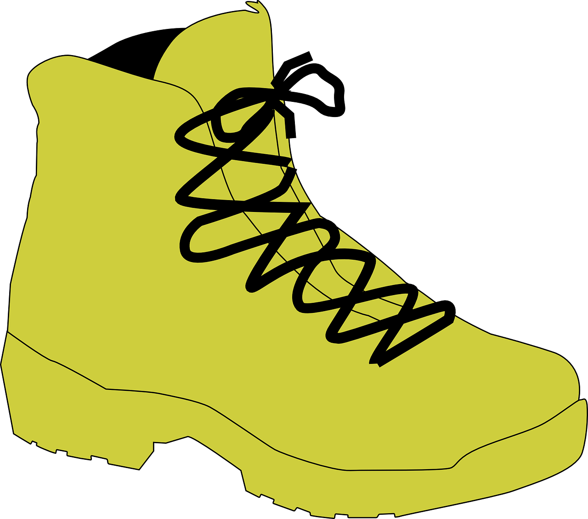
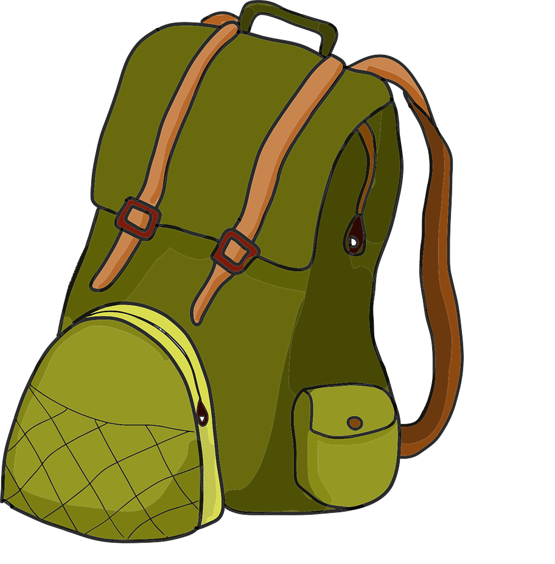

# Cognitive Task - Comprehensive Documentation

## Table of Contents
1. [Introduction](#introduction)
2. [Application Overview](#application-overview)
3. [System Architecture](#system-architecture)
4. [Task Descriptions](#task-descriptions)
5. [User Flow](#user-flow)
6. [Technical Implementation](#technical-implementation)
7. [Assets and Resources](#assets-and-resources)
8. [Usage Guide](#usage-guide)
9. [Troubleshooting](#troubleshooting)

## Introduction

This application is a cognitive assessment tool designed to evaluate various cognitive abilities through a series of computerized tasks. It implements multiple validated cognitive tests that measure working memory, attention, processing speed, and pattern recognition capabilities.

## Application Overview

The Cognitive Task application provides a standardized platform for administering cognitive tests in research or educational settings. It includes:

- Student/participant identification system
- Multiple cognitive assessment tasks
- Practice and real test modes
- Data collection and export functionality
- Fullscreen mode for distraction-free testing
- Responsive design for various screen sizes

## System Architecture

The application uses a client-side architecture with:
- HTML for structure
- CSS for styling and responsive design
- JavaScript for interactive functionality and test logic

Key components include:
- Screen transition system
- Counterbalancing mechanism for test order
- Stimulus presentation controls
- Response collection and validation
- Results storage and export

### State Management
```javascript
// Global Game State
const gameState = { 
    studentId: null, 
    scheme: null, 
    isRealGame: false,
    isCountingGame: false,
    isPatternGame: false,
    isPatternRecognitionGame: false,
    currentRound: 0, 
    gameResults: [],
    correctCounts: null,
    isBackward: false,
    currentPattern: null,
    currentPatternType: null,
    patternAnswer: null,
    originalShapesData: null,
    movedShapeIndices: null
};

// Timer Management System
const TimerManager = {
    timers: {},
    intervals: {},
    setTimeout: function(callback, delay, id) { /* ... */ },
    clearTimeout: function(id) { /* ... */ },
    setInterval: function(callback, delay, id) { /* ... */ },
    clearInterval: function(id) { /* ... */ },
    clearAll: function() { /* ... */ },
    clearCategory: function(category) { /* ... */ }
};
```

### Event Handling System
```javascript
// Initialize all event listeners
function initializeEventListeners() {
    // Fullscreen handling
    document.getElementById('fullscreenButton')
        .addEventListener('click', enterFullscreen);
    
    // Student ID submission
    document.getElementById('studentIdButton')
        .addEventListener('click', submitStudentId);
    
    // Scheme selection
    document.querySelectorAll('.scheme-button').forEach(button => {
        button.addEventListener('click', (e) => {
            selectScheme(e.target.dataset.scheme);
        });
    });
    
    // Task-specific listeners
    addTaskEventListeners();
    
    // Response submission listeners
    addResponseListeners();
    
    // Navigation listeners
    addNavigationListeners();
}

// Error handling wrapper
function handleError(fn) {
    return function (...args) {
        try { 
            return fn.apply(this, args); 
        } catch (error) { 
            console.error('Error:', error); 
            alert('An error occurred. Please try again.'); 
        }
    };
}
```

### Screen Management System
```javascript
const SCREENS = {
    fullscreen: {
        id: 'fullscreen-prompt',
        content: `
            <p>Press the button below to switch to full screen mode.</p>
            <button id="fullscreenButton">Continue</button>
        `
    },
    studentId: {
        id: 'student-id',
        content: `
            <p>Enter the participant's student ID:</p>
            <input type="text" id="studentIdInput">
            <button id="studentIdButton">Continue</button>
        `
    },
    // ... other screen definitions
};

function showScreen(screenId) {
    console.log(`Showing screen: ${screenId}`);
    TimerManager.clearAll();
    
    const screens = document.querySelectorAll('.screen');
    screens.forEach(screen => screen.classList.add('hidden'));
    
    const targetScreen = document.getElementById(screenId);
    if (targetScreen) {
        targetScreen.classList.remove('hidden');
        if (screenId === 'digit-game-area') {
            targetScreen.style.display = 'flex';
        }
    }
}
```

## Task Descriptions

### 1. Shape Counting Task
#### Overview
Participants view a series of shapes and count the occurrences of specific shape types. This measures attention and working memory.

#### Implementation Details
```javascript
const CONFIG = {
    practiceMode: { minShapes: 5, maxShapes: 10, displayTime: 1000, blankTime: 250 },
    realMode: { minShapes: 10, maxShapes: 15, displayTime: 1000, blankTime: 250, rounds: 5 }
};
```

#### Core Functions
```javascript
function startShapeSequence() {
    const shapes = ['circle', 'square', 'triangle'];
    const shapeCount = { circle: 0, square: 0, triangle: 0 };
    const config = gameState.isRealGame ? CONFIG.realMode : CONFIG.practiceMode;
    const totalShapes = Math.floor(Math.random() * (config.maxShapes - config.minShapes + 1)) + config.minShapes;
    
    let sequence = Array.from({ length: totalShapes }, () => {
        const shape = shapes[Math.floor(Math.random() * shapes.length)];
        shapeCount[shape]++;
        return shape;
    });
    
    gameState.correctCounts = shapeCount;
    animateShapes(sequence);
}

function animateShapes(sequence) {
    let index = 0;
    const shapeElement = document.querySelector('.shape');
    const shapeConfig = gameState.isRealGame ? CONFIG.realMode : CONFIG.practiceMode;
    
    function displayNext() {
        if (index >= sequence.length) {
            showScreen('answer-form');
            return;
        }
        shapeElement.className = 'shape ' + sequence[index];
        setTimeout(() => {
            shapeElement.className = 'shape blank';
            setTimeout(() => {
                index++;
                displayNext();
            }, shapeConfig.blankTime);
        }, shapeConfig.displayTime);
    }
    displayNext();
}
```

#### Flow
1. Practice Mode:
   - Display 5-10 shapes
   - 1000ms display time per shape
   - 250ms blank time between shapes
2. Real Mode:
   - Display 10-15 shapes
   - Same timing parameters
   - 5 rounds total

### 2. Object Counting Task
#### Overview
Similar to the shape task but uses common objects (money, bus, face) instead of geometric shapes.

#### Implementation Details
```javascript
const CONFIG = {
    countingMode: { minObjects: 5, maxObjects: 10, displayTime: 1000, blankTime: 250 },
    countingRealMode: { minObjects: 10, maxObjects: 15, displayTime: 1000, blankTime: 250, rounds: 5 }
};
```

#### Core Functions
```javascript
function startCountingSequence() {
    const config = gameState.isRealGame ? CONFIG.countingRealMode : CONFIG.countingMode;
    const objectCount = {
        '5dollar': Math.floor(Math.random() * (config.maxObjects / 3)) + 1,
        'bus': Math.floor(Math.random() * (config.maxObjects / 3)) + 1,
        'face': Math.floor(Math.random() * (config.maxObjects / 3)) + 1
    };
    
    const sequence = [];
    Object.entries(objectCount).forEach(([obj, count]) => {
        for (let i = 0; i < count; i++) sequence.push(obj);
    });
    
    // Shuffle sequence
    sequence.sort(() => Math.random() - 0.5);
    gameState.correctCounts = objectCount;
    animateCountingObjects(sequence);
}

function animateCountingObjects(sequence) {
    let index = 0;
    const shapeElement = document.querySelector('.shape');
    const config = gameState.isRealGame ? CONFIG.countingRealMode : CONFIG.countingMode;
    
    function displayNext() {
        if (index >= sequence.length) {
            showScreen('counting-answer-form');
            return;
        }
        const currentObject = sequence[index];
        shapeElement.innerHTML = ``;
        setTimeout(() => {
            shapeElement.innerHTML = '';
            setTimeout(() => {
                index++;
                displayNext();
            }, config.blankTime);
        }, config.displayTime);
    }
    displayNext();
}
```

### 3. Digit Span Task
#### Overview
A classic memory test for recalling digit sequences forward and backward.

#### Implementation Details
```javascript
const CONFIG = {
    digitSpanMode: { 
        displayTime: 1000, 
        blankTime: 500, 
        startDigits: 3, 
        maxDigits: 9 
    }
};
```

#### Core Functions
```javascript
function startDigitSequence() {
    const sequenceLength = gameState.isRealGame ? 
        Math.min(3 + gameState.currentRound, 9) : 3;
    
    const sequence = Array.from(
        { length: sequenceLength }, 
        () => Math.floor(Math.random() * 10)
    );
    
    gameState.correctSequence = sequence;
    animateDigits(sequence);
}

function animateDigits(sequence) {
    let index = 0;
    const digitElement = document.querySelector('.digit');
    const config = CONFIG.digitSpanMode;
    
    function showNextDigit() {
        if (index >= sequence.length) {
            showScreen('digit-span-response');
            return;
        }
        digitElement.textContent = sequence[index];
        setTimeout(() => {
            digitElement.textContent = '';
            setTimeout(() => {
                index++;
                showNextDigit();
            }, config.blankTime);
        }, config.displayTime);
    }
    showNextDigit();
}
```

### 4. Object Span Task
#### Overview
Similar to digit span but uses visual objects instead of numbers.

#### Implementation Details
```javascript
const OBJECT_SPAN_CONFIG = {
    displayTime: 1500,
    blankTime: 750,
    startObjects: 3,
    maxObjects: 9,
    objectMapping: {
        1: { name: 'bread', image: 'images/Bread.png' },
        2: { name: 'car', image: 'images/Car.png' },
        // ... more object mappings
    }
};
```

#### Core Functions
```javascript
function startObjectSequence() {
    const objectSequence = [];
    for (let i = 0; i < objectSpanState.currentLevel; i++) {
        const objectDigit = Math.floor(Math.random() * 9) + 1;
        objectSequence.push(objectDigit);
    }
    
    objectSpanState.sequence = objectSequence;
    animateObjects(objectSequence);
}

function animateObjects(sequence) {
    let index = 0;
    const objectDisplay = document.querySelector('.object-display');
    
    function showNextObject() {
        if (index >= sequence.length) {
            showScreen('object-span-response');
            return;
        }
        const objectData = OBJECT_SPAN_CONFIG.objectMapping[sequence[index]];
        const imgElement = new Image();
        imgElement.src = objectData.image;
        objectDisplay.innerHTML = '';
        objectDisplay.appendChild(imgElement);
        
        setTimeout(() => {
            objectDisplay.innerHTML = '';
            setTimeout(() => {
                index++;
                showNextObject();
            }, OBJECT_SPAN_CONFIG.blankTime);
        }, OBJECT_SPAN_CONFIG.displayTime);
    }
    showNextObject();
}
```

### 5. Spatial Memory Task
#### Overview
Tests visuospatial memory by having participants recall shape positions in a grid.

#### Implementation Details
```javascript
const spatialConfig = {
    practice: { maxShapes: 5, displayTime: 30000 },
    real: { maxShapes: 20, displayTime: 90000 }
};
```

#### Core Functions
```javascript
function initializeSpatialGrid(isRealGame) {
    const config = isRealGame ? spatialConfig.real : spatialConfig.practice;
    const shapesData = generateRandomShapes(config.maxShapes);
    gameState.originalShapesData = [...shapesData];
    
    const gridContainer = document.querySelector('.grid-container');
    shapesData.forEach((shapeData, index) => {
        const cell = document.createElement('div');
        cell.className = 'grid-cell';
        cell.dataset.index = index;
        
        const shapeImg = document.createElement('img');
        shapeImg.src = `shapes/${shapeData.name}.png`;
        shapeImg.className = 'grid-shape';
        
        cell.appendChild(shapeImg);
        gridContainer.appendChild(cell);
    });
    
    startSpatialTimer(config.displayTime);
}

function evaluateSpatialResponse(isRealGame) {
    const selectedCells = document.querySelectorAll('.grid-cell.selected');
    const movedIndices = gameState.movedShapeIndices;
    
    let correctCount = 0;
    let incorrectCount = 0;
    
    selectedCells.forEach(cell => {
        const cellIndex = parseInt(cell.dataset.index);
        if (movedIndices.includes(cellIndex)) {
            correctCount++;
        } else {
            incorrectCount++;
        }
    });
    
    const totalScore = correctCount - incorrectCount;
    showSpatialResults(correctCount, incorrectCount, totalScore, isRealGame);
}
```

### 6. Pattern Recognition Task
#### Overview
Tests pattern recognition abilities through various pattern types.

#### Implementation Details
```javascript
const CONFIG = {
    patternRecognitionMode: { 
        displayTime: 3000, 
        blankTime: 500, 
        rounds: 5, 
        practiceDifficulty: 'easy',
        realDifficulty: 'medium'
    }
};

const patternTypes = [
    'wordRelationship',
    'categoryMatching',
    'memoryRecall',
    'visualPattern'
];
```

#### Core Functions
```javascript
function showPatternGame() {
    const patternType = patternTypes[Math.floor(Math.random() * patternTypes.length)];
    const difficulty = gameState.isRealGame ? 
        CONFIG.patternRecognitionMode.realDifficulty : 
        CONFIG.patternRecognitionMode.practiceDifficulty;
    
    const patterns = patternData[patternType][difficulty];
    const pattern = patterns[Math.floor(Math.random() * patterns.length)];
    
    gameState.currentPattern = pattern;
    gameState.currentPatternType = patternType;
    
    displayPattern(patternType, pattern);
}

function displayPattern(patternType, pattern) {
    const contentArea = document.querySelector('.pattern-content');
    contentArea.innerHTML = '';
    
    switch(patternType) {
        case 'wordRelationship':
            contentArea.innerHTML = `<h2>Word Relationship</h2><p>${pattern.prompt}</p>`;
            break;
        case 'categoryMatching':
            // Display category matching interface
            break;
        case 'memoryRecall':
            // Display memory recall interface
            break;
        case 'visualPattern':
            // Display visual pattern interface
            break;
    }
    
    setTimeout(() => {
        showPatternAnswerForm(patternType, pattern);
    }, CONFIG.patternRecognitionMode.displayTime);
}
```

## User Flow

1. **Initial Setup**
   - Enter student ID
   - Select testing scheme (counterbalancing)
   - Enter fullscreen mode

2. **Task Flow** (for each cognitive task)
   - Introduction screen
   - Instructions
   - Practice trials with feedback
   - Real test trials
   - Results display

3. **Completion**
   - Display overall results
   - Export data
   - Option to start another task

## Technical Implementation

### Core Functions

#### Student Identification
```javascript
function validateStudentId(id) { return /^\d{5,10}$/.test(id); }
function submitStudentId() {
    // Validates and stores student ID
}
```

#### Screen Management
```javascript
function transitionScreens(hideId, showId) {
    // Handles transition between different screens/sections
}
function showScreen(screenId) {
    // Shows a specific screen
}
```

#### Task Administration
```javascript
function startPractice() {
    // Initializes practice mode for tasks
}
function startRealGame() {
    // Initializes real test mode
}
```

#### Stimulus Presentation
```javascript
function animateShapes(sequence) {
    // Controls presentation of shapes
}
function animateDigits(sequence) {
    // Controls presentation of digits
}
function animateObjects(sequence) {
    // Controls presentation of objects
}
```

#### Data Collection and Export
```javascript
function storeRoundResults(userAnswers) {
    // Stores test results
}
function exportCSV(results) {
    // Exports results as CSV
}
function saveResultsAsJSON(results) {
    // Saves results as JSON
}
```

### Task-Specific Functions

#### Shape/Object Counting
```javascript
function startCountingSequence() {
    // Initializes counting task
}
function submitCountingAnswers() {
    // Processes counting task responses
}
```

#### Digit/Object Span
```javascript
function startDigitSpanGame()
function startObjectSpanPractice()
function submitDigitSpanResponse()
function submitObjectSpanResponse()
```

#### Spatial Memory
```javascript
function initializeSpatialGrid(isRealGame) {
    // Sets up spatial memory grid
}
function evaluateSpatialResponse(isRealGame) {
    // Evaluates participant's spatial memory response
}
```

## Assets and Resources

### Image Assets
1. **Geometric Shapes** (`/shapes/`)
   - Triangles, squares, circles, hearts, pentagons
   - Various colors (red, blue, green, yellow, black, purple)

2. **Common Objects** (`/images/`)
   - Household items: Book, Bag, Car, Chair, Computer, Money, Pot, Shoe, Bread

3. **Counting Objects** (`/dollarmanbus/`)
   - 5dollar.jpg
   - bus.jpg
   - face.jpg

### Styling
The application uses a comprehensive CSS stylesheet (`styles.css`) that includes:
- Responsive design for various screen sizes
- Transitions and animations for stimulus presentation
- Accessible form controls and buttons
- Special styling for different cognitive tasks

## Usage Guide

### Setup Requirements
- Modern web browser (Chrome, Firefox, Safari, Edge)
- JavaScript enabled
- Fullscreen capability
- Sufficient screen resolution (minimum 480px width)

### Running the Application
1. Load the application in a web browser
2. Enter a valid student ID (5-10 digits)
3. Select the appropriate testing scheme
4. Enter fullscreen mode when prompted
5. Follow on-screen instructions for each task

### Data Collection
Results are collected and can be exported in CSV or JSON format after completion of tasks. Data includes:
- Student identifier
- Task type and parameters
- Stimulus sequences
- Response accuracy
- Response times
- Trial-by-trial performance

## Troubleshooting

### Common Issues
1. **Screen transitions not working**
   - Check browser compatibility
   - Ensure JavaScript is enabled

2. **Images not loading**
   - Verify that image paths are correct
   - Check browser console for 404 errors

3. **Performance issues**
   - Close other applications to free system resources
   - Reduce browser extensions running in background

4. **Export functionality not working**
   - Check browser download permissions
   - Try using a different browser

### Best Practices
- Use a dedicated testing environment
- Ensure consistent internet connectivity
- Use a device with adequate processing power
- Test in fullscreen mode to minimize distractions 

## Detailed Task Flows

### 1. Shape Counting Task Flow


### 2. Object Counting Task Flow


### 3. Digit Span Task Flow


## Data Export Format

### CSV Format
```javascript
const csvHeader = [
    'rt', 'stimulus', 'button_pressed', 'variable', 
    'trial_type', 'trial_index', 'time_elapsed', 
    'internal_node_id', 'ID', 'counter_balance', 
    'view_history', 'task', 'animation_sequence', 
    'responses', 'correct', 'remark'
].join(',');

function exportCSV(results) {
    const csvRows = results.rounds.map(round => ({
        rt: calculateResponseTime(round),
        stimulus: '',
        button_pressed: 0,
        variable: determineVariable(round),
        trial_type: 'html-button-response',
        trial_index: round.index,
        time_elapsed: calculateTimeElapsed(round),
        internal_node_id: generateNodeId(round),
        ID: parseInt(results.studentId),
        counter_balance: parseInt(results.scheme),
        view_history: JSON.stringify({screens: ['instructions', 'game', 'response']}),
        task: determineTaskName(round),
        animation_sequence: JSON.stringify(generateAnimationSequence(round)),
        responses: JSON.stringify(formatResponses(round)),
        correct: JSON.stringify(formatCorrect(round)),
        remark: calculateCorrectness(round)
    }));
    
    // Format and download CSV
    const csvContent = [csvHeader, ...csvRows.map(row => 
        Object.values(row).map(formatCSVValue).join(',')
    )].join('\n');
    
    downloadCSV(csvContent, generateFilename());
}
```

## Asset Organization

### Directory Structure
```
cognitivetask/
├── dollarmanbus/
│   ├── face.jpg
│   ├── bus.jpg
│   └── 5dollar.jpg
├── images/
│   ├── Shoe.png
│   ├── Pot.png
│   ├── Money.png
│   ├── Computer.png
│   ├── Chair.png
│   ├── Car.png
│   ├── Bread.png
│   ├── Book.png
│   └── Bag.png
├── shapes/
│   ├── yellowsquare.png
│   ├── yellowpentagon.png
│   ├── redsquare.png
│   ├── redheart.png
│   ├── purpletraingle.png
│   ├── greentraingle.png
│   ├── greenpentagon.png
│   ├── greencircle.png
│   ├── blueheart.png
│   ├── bluecircle.png
│   ├── blacktraingle.png
│   ├── blackpentagon.png
│   ├── blacksquare.png
│   └── blackcircle.png
├── js/
│   ├── utils/
│   ├── screens/
│   ├── script.js
│   └── config.js
└── styles.css
```

## HTML Structure

### Base Layout
```html
<!DOCTYPE html>
<html lang="en">
<head>
    <meta charset="UTF-8">
    <meta name="viewport" content="width=device-width, initial-scale=1.0">
    <title>Cognitive Task Assessment</title>
    <link rel="stylesheet" href="styles.css">
</head>
<body>
    <!-- Screen Container -->
    <div class="container">
        <!-- Fullscreen Prompt -->
        <div id="fullscreen-prompt" class="screen">
            <p>Press the button below to switch to full screen mode.</p>
            <button id="fullscreenButton">Continue</button>
        </div>

        <!-- Student ID Input -->
        <div id="student-id" class="screen hidden">
            <p>Enter the participant's student ID:</p>
            <input type="text" id="studentIdInput">
            <button id="studentIdButton">Continue</button>
        </div>

        <!-- Task Selection -->
        <div id="counter-balance" class="screen hidden">
            <div class="button-group">
                <button class="scheme-button" data-scheme="1">Task 1</button>
                <button class="scheme-button" data-scheme="2">Task 2</button>
                <button class="scheme-button" data-scheme="3">Task 3</button>
                <button class="scheme-button" data-scheme="4">Task 4</button>
            </div>
        </div>

        <!-- Game Areas -->
        <div id="game-area" class="screen hidden">
            <div class="shape"></div>
        </div>

        <div id="digit-game-area" class="screen hidden">
            <div class="digit"></div>
        </div>

        <div id="object-game-area" class="screen hidden">
            <div class="object-display"></div>
        </div>

        <!-- Response Forms -->
        <div id="answer-form" class="screen hidden">
            <!-- Dynamic content based on task -->
        </div>

        <!-- Results Display -->
        <div id="results" class="screen hidden">
            <!-- Dynamic results content -->
        </div>
    </div>
    <script src="js/config.js"></script>
    <script src="js/script.js"></script>
</body>
</html>
```

## CSS Styling Details

### Core Styles
```css
/* Base styles */
body {
    margin: 0;
    padding: 0;
    font-family: 'Segoe UI', Arial, sans-serif;
    min-height: 100vh;
    background: white;
    line-height: 1.6;
    display: flex;
    justify-content: center;
    align-items: center;
    overflow: hidden;
    position: fixed;
    width: 100%;
    height: 100%;
}

/* Screen styles */
.screen {
    position: absolute;
    top: 50%;
    left: 50%;
    transform: translate(-50%, -50%);
    width: 60%;
    max-width: 800px;
    padding: 30px;
    box-sizing: border-box;
    opacity: 1;
    transition: opacity 0.3s ease;
    min-height: 200px;
    display: flex;
    flex-direction: column;
    justify-content: center;
    align-items: center;
    background: white;
    border-radius: 16px;
    border: 2px solid #333;
}

/* Game area specific styles */
#game-area {
    position: fixed;
    top: 0;
    left: 0;
    width: 100vw;
    height: 100vh;
    background: white;
    z-index: 1000;
    display: flex;
    justify-content: center;
    align-items: center;
}

/* Shape styles */
.shape {
    position: relative;
    margin: 0 auto;
    min-width: 250px;
    min-height: 250px;
}

/* Responsive design */
@media (max-width: 768px) {
    .screen {
        width: 90%;
        padding: 20px;
    }
    
    .shape {
        min-width: 200px;
        min-height: 200px;
    }
}
```

## Task-Specific Implementation Details

### 1. Shape Counting Task

#### HTML Structure
```html
<div id="shape-counting-task" class="screen hidden">
    <div class="shape-container">
        <div class="shape"></div>
    </div>
    <div class="response-form hidden">
        <div class="number-input">
            <label>Circles:</label>
            <button class="decrement">-</button>
            <input type="number" id="circle-count" min="0" max="20" value="0">
            <button class="increment">+</button>
        </div>
        <!-- Similar inputs for squares and triangles -->
        <button id="submitCountsButton">Submit</button>
    </div>
</div>
```

#### CSS Styles
```css
.shape-container {
    display: flex;
    justify-content: center;
    align-items: center;
    height: 300px;
}

.circle {
    border-radius: 50%;
    background: #e8e8cf;
}

.square {
    background: #4a90e2;
}

.triangle {
    clip-path: polygon(50% 0%, 0% 100%, 100% 100%);
    background: #ff6b6b;
}
```

### 2. Object Counting Task

#### Configuration
```javascript
const COUNTING_OBJECTS = {
    '5dollar': {
        image: 'dollarmanbus/5dollar.jpg',
        name: 'Five Dollar Bill'
    },
    'bus': {
        image: 'dollarmanbus/bus.jpg',
        name: 'Bus'
    },
    'face': {
        image: 'dollarmanbus/face.jpg',
        name: 'Face'
    }
};

const COUNTING_STYLES = {
    imageSize: '250px',
    displayDuration: 1000,
    blankDuration: 250
};
```

### 3. Digit Span Task

#### Sequence Generation
```javascript
function generateDigitSequence(length) {
    return Array.from(
        { length }, 
        () => Math.floor(Math.random() * 10)
    );
}

function validateDigitResponse(response, sequence, isBackward) {
    const expectedResponse = isBackward ? 
        [...sequence].reverse().join('') : 
        sequence.join('');
    return response === expectedResponse;
}
```

### 4. Object Span Task

#### Object Configuration
```javascript
const OBJECTS = {
    BREAD: { id: 1, name: 'bread', image: 'images/Bread.png' },
    CAR: { id: 2, name: 'car', image: 'images/Car.png' },
    POT: { id: 3, name: 'pot', image: 'images/Pot.png' },
    MONEY: { id: 4, name: 'money', image: 'images/Money.png' },
    BOOK: { id: 5, name: 'book', image: 'images/Book.png' },
    CHAIR: { id: 6, name: 'chair', image: 'images/Chair.png' },
    SHOE: { id: 7, name: 'shoe', image: 'images/Shoe.png' },
    BAG: { id: 8, name: 'bag', image: 'images/Bag.png' },
    COMPUTER: { id: 9, name: 'computer', image: 'images/Computer.png' }
};
```

### 5. Spatial Memory Task

#### Grid Generation
```javascript
function generateGrid(rows, cols) {
    const grid = document.createElement('div');
    grid.className = 'grid-container';
    grid.style.gridTemplateColumns = `repeat(${cols}, 1fr)`;
    
    for (let i = 0; i < rows * cols; i++) {
        const cell = document.createElement('div');
        cell.className = 'grid-cell';
        cell.dataset.index = i;
        grid.appendChild(cell);
    }
    
    return grid;
}
```

### 6. Pattern Recognition Task

#### Pattern Types
```javascript
const PATTERN_TYPES = {
    WORD_RELATIONSHIP: {
        type: 'wordRelationship',
        displayTime: 3000,
        responseTime: null,
        scoring: (response, correct) => response === correct
    },
    CATEGORY_MATCHING: {
        type: 'categoryMatching',
        displayTime: 3000,
        responseTime: null,
        scoring: (response, correct) => 
            response.length === correct.length && 
            response.every(r => correct.includes(r))
    },
    MEMORY_RECALL: {
        type: 'memoryRecall',
        displayTime: 2000,
        responseTime: null,
        scoring: (response, correct) => response === correct
    },
    VISUAL_PATTERN: {
        type: 'visualPattern',
        displayTime: 3000,
        responseTime: null,
        scoring: (response, correct) => response === correct
    }
};
```

## Performance Optimization

### Image Preloading
```javascript
function preloadImages(images) {
    return Promise.all(images.map(src => {
        return new Promise((resolve, reject) => {
            const img = new Image();
            img.onload = resolve;
            img.onerror = reject;
            img.src = src;
        });
    }));
}

// Usage
const imagesToPreload = [
    ...Object.values(COUNTING_OBJECTS).map(obj => obj.image),
    ...Object.values(OBJECTS).map(obj => obj.image)
];

preloadImages(imagesToPreload).then(() => {
    console.log('All images preloaded');
}).catch(error => {
    console.error('Error preloading images:', error);
});
```

### Memory Management
```javascript
function cleanupTask() {
    // Clear all timers
    TimerManager.clearAll();
    
    // Clear any large objects from memory
    if (gameState.originalShapesData) {
        gameState.originalShapesData = null;
    }
    
    // Remove event listeners
    const gameArea = document.getElementById('game-area');
    if (gameArea) {
        const clone = gameArea.cloneNode(true);
        gameArea.parentNode.replaceChild(clone, gameArea);
    }
}
```

### Object Span Task Response Screen

#### HTML Structure
```html
<div id="object-span-response" class="screen">
    <h2>Enter the objects you saw in order</h2>
    <div class="response-container">
        <div class="input-section">
            <input 
                type="text" 
                id="object-response" 
                class="response-input" 
                placeholder="Type object names separated by spaces"
                autocomplete="off"
            >
            <button id="submitObjectResponseButton" class="submit-button">Submit</button>
        </div>
        
        <div class="object-reference-grid">
            <div class="reference-row">
                <div class="reference-item">
                    
                    <span class="object-label">bread</span>
                </div>
                <div class="reference-item">
                    
                    <span class="object-label">car</span>
                </div>
                <div class="reference-item">
                    
                    <span class="object-label">pot</span>
                </div>
            </div>
            <div class="reference-row">
                <div class="reference-item">
                    
                    <span class="object-label">money</span>
                </div>
                <div class="reference-item">
                    
                    <span class="object-label">book</span>
                </div>
                <div class="reference-item">
                    
                    <span class="object-label">chair</span>
                </div>
            </div>
            <div class="reference-row">
                <div class="reference-item">
                    
                    <span class="object-label">shoe</span>
                </div>
                <div class="reference-item">
                    
                    <span class="object-label">bag</span>
                </div>
                <div class="reference-item">
                    
                    <span class="object-label">computer</span>
                </div>
            </div>
        </div>
    </div>
    <div class="instructions">
        <p>Type the names of the objects you saw in the order they appeared.</p>
        <p>Separate each object name with a space.</p>
        <p>Example: "bread car pot"</p>
    </div>
</div>
```

#### CSS Styles
```css
#object-span-response {
    max-width: 900px;
    padding: 2rem;
    background: #ffffff;
    border-radius: 12px;
    box-shadow: 0 4px 6px rgba(0, 0, 0, 0.1);
}

.response-container {
    width: 100%;
    display: flex;
    flex-direction: column;
    gap: 2rem;
}

.input-section {
    display: flex;
    gap: 1rem;
    width: 100%;
    max-width: 600px;
    margin: 0 auto;
}

.response-input {
    flex: 1;
    padding: 12px 16px;
    font-size: 16px;
    border: 2px solid #e0e0e0;
    border-radius: 8px;
    transition: border-color 0.3s ease;
}

.response-input:focus {
    border-color: #4a90e2;
    outline: none;
    box-shadow: 0 0 0 3px rgba(74, 144, 226, 0.1);
}

.submit-button {
    padding: 12px 24px;
    background: #4a90e2;
    color: white;
    border: none;
    border-radius: 8px;
    font-weight: 600;
    cursor: pointer;
    transition: background-color 0.3s ease;
}

.submit-button:hover {
    background: #357abd;
}

.object-reference-grid {
    display: flex;
    flex-direction: column;
    gap: 1.5rem;
    padding: 1.5rem;
    background: #f8f9fa;
    border-radius: 12px;
    margin: 1rem 0;
}

.reference-row {
    display: flex;
    justify-content: center;
    gap: 2rem;
}

.reference-item {
    display: flex;
    flex-direction: column;
    align-items: center;
    gap: 0.5rem;
}

.reference-image {
    width: 80px;
    height: 80px;
    object-fit: contain;
    padding: 8px;
    background: white;
    border: 1px solid #e0e0e0;
    border-radius: 8px;
    transition: transform 0.2s ease;
}

.reference-item:hover .reference-image {
    transform: scale(1.05);
}

.object-label {
    font-size: 14px;
    font-weight: 500;
    color: #333;
}

.instructions {
    margin-top: 2rem;
    padding: 1rem;
    background: #e8f4ff;
    border-radius: 8px;
    text-align: center;
}

.instructions p {
    margin: 0.5rem 0;
    color: #2c3e50;
}

@media (max-width: 768px) {
    .reference-row {
        gap: 1rem;
    }

    .reference-image {
        width: 60px;
        height: 60px;
    }

    .input-section {
        flex-direction: column;
    }

    .submit-button {
        width: 100%;
    }
}

@media (max-width: 480px) {
    .reference-image {
        width: 50px;
        height: 50px;
    }

    .object-label {
        font-size: 12px;
    }
}
```

#### JavaScript Enhancements
```javascript
function initializeObjectSpanResponse() {
    const input = document.getElementById('object-response');
    const referenceItems = document.querySelectorAll('.reference-item');
    
    // Add click handlers for reference items
    referenceItems.forEach(item => {
        item.addEventListener('click', () => {
            const objectName = item.querySelector('.object-label').textContent;
            insertObjectName(objectName);
        });
    });
    
    // Add input validation and auto-completion
    input.addEventListener('input', (e) => {
        validateInput(e.target.value);
    });
    
    // Add keyboard navigation
    input.addEventListener('keydown', handleKeyboardNavigation);
}

function insertObjectName(objectName) {
    const input = document.getElementById('object-response');
    const currentValue = input.value;
    
    if (currentValue && !currentValue.endsWith(' ')) {
        input.value = currentValue + ' ' + objectName;
    } else {
        input.value = currentValue + objectName;
    }
    
    input.focus();
}

function validateInput(value) {
    const validObjects = Object.values(OBJECTS).map(obj => obj.name);
    const words = value.toLowerCase().trim().split(/\s+/);
    
    // Highlight invalid objects
    words.forEach(word => {
        if (word && !validObjects.includes(word)) {
            // Show visual feedback for invalid input
            showError(`"${word}" is not a valid object name`);
        }
    });
}

function handleKeyboardNavigation(e) {
    if (e.key === 'Enter' && !e.shiftKey) {
        e.preventDefault();
        document.getElementById('submitObjectResponseButton').click();
    }
}

function showError(message) {
    const errorDiv = document.createElement('div');
    errorDiv.className = 'error-message';
    errorDiv.textContent = message;
    
    // Remove after 3 seconds
    setTimeout(() => errorDiv.remove(), 3000);
    
    document.querySelector('.input-section').appendChild(errorDiv);
}
```

This improved design includes:

1. **Better Visual Organization**
   - Grid layout for object references
   - Clear visual hierarchy
   - Consistent spacing and alignment
   - Responsive design for different screen sizes

2. **Enhanced Usability**
   - Clickable object references to insert names
   - Clear input field with placeholder text
   - Visual feedback on hover and focus
   - Error validation and feedback
   - Keyboard navigation support

3. **Improved Instructions**
   - Clear, concise instructions
   - Example input format
   - Visual separation of different sections

4. **Accessibility Features**
   - High contrast text
   - Proper focus states
   - Screen reader friendly structure
   - Keyboard navigation support

5. **Responsive Behavior**
   - Adapts to different screen sizes
   - Maintains usability on mobile devices
   - Flexible layout that preserves functionality

6. **Performance Optimizations**
   - Efficient event handling
   - Optimized image loading
   - Smooth animations and transitions 